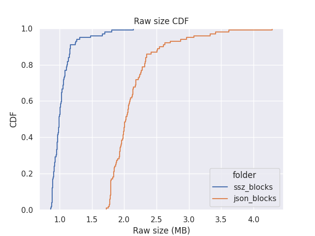

# Eth snappy benchmarks
Benchmark repository to measure the compression ratio and speed of Ethereum CL block using the snappy compression and the `Golang` implementation.

## Motivation
Ethereum CL blocks need to be broadcasted through a p2p network layer as in any other blockchain. Because the size of these blocks tends to increase over time, e.g., more validators are added to the chain over time, or we increase the size to aggregate more blocks, there is a considerable need to reduce the overall chunk of bytes that we send over the wire.

Ethereum uses the [`ssz`](https://github.com/ethereum/consensus-specs/blob/dev/ssz/simple-serialize.md) serialization (more optimized than the plain `json` ) for broadcasting, in combination with the [Snappy Compression](https://github.com/google/snappy) algorithm to broadcast all their messages over the network.



This repo brings some data on the time/performance of the snappy compression over the serialized Ethereum's beacon blocks.

## Usage

1. git clone the repository
```shell
git clone https://github.com/cortze/eth-snappy-benchmarks.git[compresion_metrics.ipynb](analysis%2Fcompresion_metrics.ipynb)
```
2. Build the go code
```shell
make build
```
3. Fetch the blocks that we want to test
```shell
bash block_downloader.sh
```
4. Run the benchmark with the given raw blocks
```shell
bash snappy_benchmark.sh
```

Note: the code execution can be modified by changing the parameters on each `<.sh>` script, where the serialization of the blocks and the output folders and formats can be defined.

    
## Results

We ran the Go version of [snappy](github.com/golang/snappy) v0.0.4 on an AMD Ryzen 9 5900X 12-Core Processor.
The current results were generated from Ethereum's [100 blocks](./target_blocks.csv) downloaded from a local Beacon Node in Mainnet.
We ran the test 10 times for each block, and we always obtained the exact same compressed result for each block, but the compression time changes, so we took the average of the ten runs. 

| metric                   | AVG JSON values | AVG SSZ values | 
|--------------------------|-----------------|------------| 
| Raw Block Size (MB)      | 2.139934        | 1.043237   | 
| Compress Block Size (MB) | 1.384319        | 0.731517   |
| Encoding Time (ms)       | 2.852173        | 1.030198   |
| Decoding Time (ms)       | 1.128296        | 0.466800   |
| Compression Speed (MB/s) | 1101.098184     | 2150.391500 |

All the results are aggregated in the following [CSV file](./analysis/block_snappy_compression_summary.csv):

